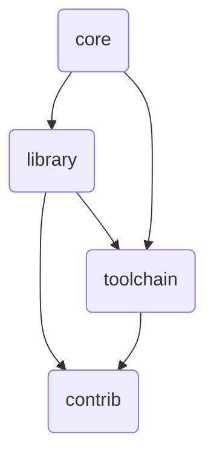

cd .. & pip install . & cd example & beet

cd ..; pip install .; cd example; beet

```mermaid
graph TD
    core(core) --> library(library)
    library --> toolchain
    core --> toolchain(toolchain)
    library --> contrib(contrib)
    toolchain --> contrib
```