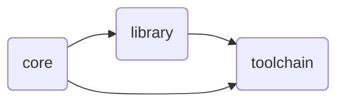

cd .. & pip install . & cd example & beet build

cd ..; pip install .; cd example; beet build

## Project Structure
```
├── core                      # Handle and verify data
│   ├── compat                #   Watch over compatability problems
│   ├── resource_locations    #   Verify resource location fomats
│   └── text_components       #   Parse and structure text components
├── library                   # Abstractions
│   ├── components            #   Abstraction for item component stacks
│   └── item                  #   Abstraction for items
└── toolchain                 # Tools for workflows
    ├── file                  #   Abstractions and parser for BeetSmith yaml definitions
    └── plugin                #   Beet plugin
```



## Beetroot Project Strcuture
1. core
   - Grundlagen für alle anderen Module
2. library
   - Eigentliche API
3. 